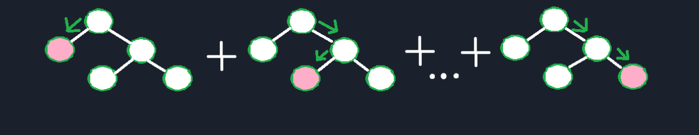
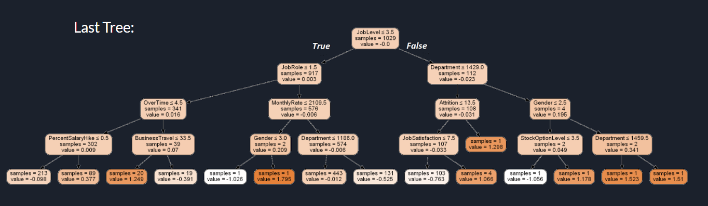
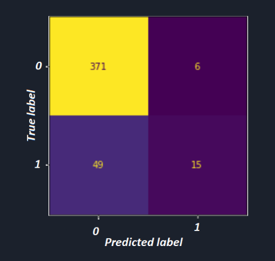

Authors :
- Kajetan Kubik
- Karol Roszak

We try few algorithms:
 - C4.5 (best solution 82 %)
 - KNN (best solution 84 %)

But the best result we get using...

Gradient Boosting Classifier
After Hyperparameter tuning we achive 87% correctness. 

One of finnly trees are presenting here:

Confusion Matrix:

